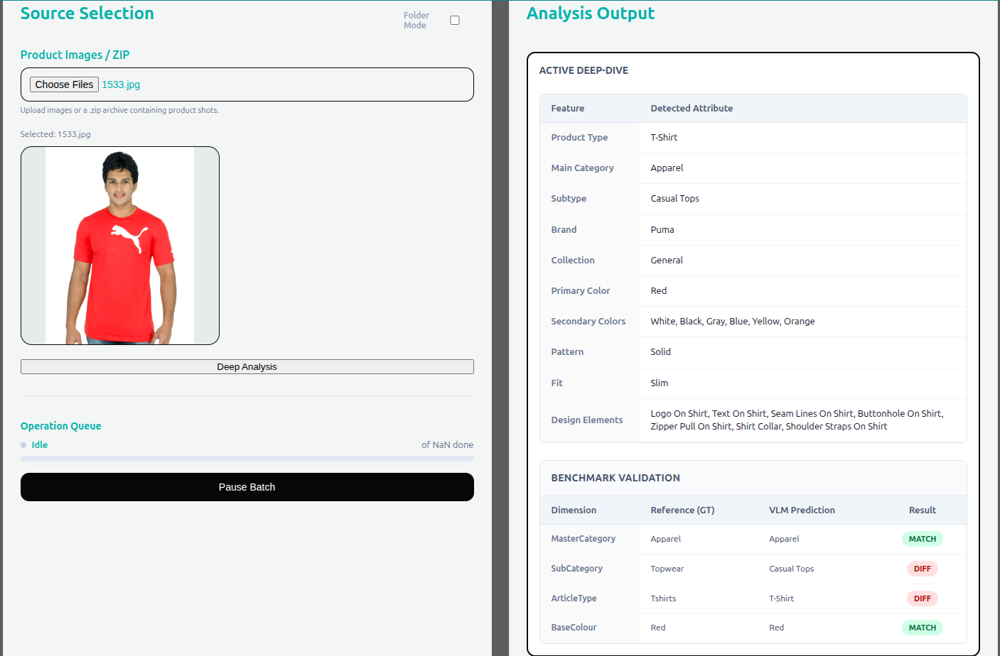

# OneProductIQ: Advanced Metadata Enrichment



## Overview
**OneProductIQ** is a high-performance system designed for bulk product metadata enrichment and automated catalog verification. It transforms raw product images into structured, clean, and benchmarked data using a quantized **FastVLM-0.5B-ONNX** model running on **CUDA**.

The system supports two distinct workflows:
- **Deep Analysis**: A precise single-image deep dive with side-by-side **Ground Truth (GT)** verification.
- **Batch Processing**: High-volume sequential processing of hundreds of images with automated reliability filtering and CSV export.

---

## Architecture Overview

```
+-------------------+       +-------------------+       +-------------------+
|   Frontend (Vite) | <---> |   Backend (Node)  | <---> |       VLM         |
+-------------------+       +-------------------+       +-------------------+
        │                         │                           │
        │   • Hybrid UI Mode      │   • Sequential Queue      │   • ONNX Runtime
        │   • Benchmark Dashboard │   • ZIP Extraction        │   • CUDA Acceleration
        │   • Progress Polling    │   • GT Comparison         │   • Self-Healing JSON
        │   • Local CSV Export    │   • Session Persistence   │   • Reliability Layer
        └──────────────────────────┘                       └───────────────────┘
```

### Key Components

| Layer | Responsibility | Main Files |
|-------|----------------|------------|
| **Frontend** | React-driven UI with hybrid analysis modes. Features a premium Metadata Table and Benchmark Validation panel. | `demo-app-client/src/App.jsx` |
| **Backend** | Sequential image queue with integrated **Ground Truth** mapping and self-healing JSON extraction. | `demo-app/server.cjs` |
| **ML Model** | FastVLM-0.5B-ONNX with deterministic inference tuned for zero-hallucination structured output. | Integrated via `@huggingface/transformers` |

---

## Core Features

### 🚀 High-Volume Batching
- **ZIP/Folder Intake**: Upload thousands of product shots or select entire local directories for immediate queueing.
- **Sequential Queueing**: Optimized model inference that prevents VRAM overflows by processing tasks one-by-one.

### 🛡️ Reliability Layer
- **Self-Healing JSON**: Heuristic repair system that fixes truncated or malformed AI outputs (unclosed quotes, braces, brackets).
- **Hallucination Shield**: Aggressive repetition penalties and semantic key merging to ensure fixed, predictable schemas.
- **Automated Deduplication**: Smart array cleaning and color-list capping to prevent metadata "spiraling."

### 📊 Intelligent Benchmarking
- **GT Verification**: Automated side-by-side comparison against industry datasets (`styles.csv`).
- **Accuracy Reporting**: Visual status pills (Match/Diff) for instant accuracy tracking across Gender, Category, and Color.

---

## Setup & Development

### Prerequisites
- **Node.js** (v18+)
- **GPU with CUDA Support** (Recommended for performance)

### Fast Start
1. **Root Install**: `npm install`
2. **Backend**: `cd demo-app && node server.cjs`
3. **Frontend**: `cd demo-app-client && npm run dev`
4. **Access**: Navigate to `http://localhost:5173`

---

## Usage Flow

1. **Select Mode**: Use the "Folder Mode" toggle to select directory or individual assets.
2. **Deep Dive**: Select 1 image and click **Deep Analysis** to trigger the **Benchmark Validation** panel.
3. **Batch Launch**: monitor progress via the **Operation Queue** as the system processes your bulk catalog.
4. **Export**: Click *Export Batch CSV* to download structured metadata with integrated accuracy summaries.

---

## Roadmap

- [X] Phase 1-2: Core VLM Integration & Single-Image UI
- [X] Phase 3: Bulk Processing & ZIP/Folder Support
- [X] Phase 4: Output Verification & Reliability Layer
- [ ] Phase 5: KV Cache Optimization & Constrained Logic Decoding

---

## Lessons Learned
Recorded in `docs/lessons.md`. Key insights include:
- The power of **Greedy Decoding** for attribute consistency.
- Implementing **Dirty JSON Healing** for resource-constrained VLM outputs.
- Synchronizing **Vite Proxy rules** with backend router expansion.

---

## License
MIT License

*Updated by the OneProductIQ team on 2026-05-06.*