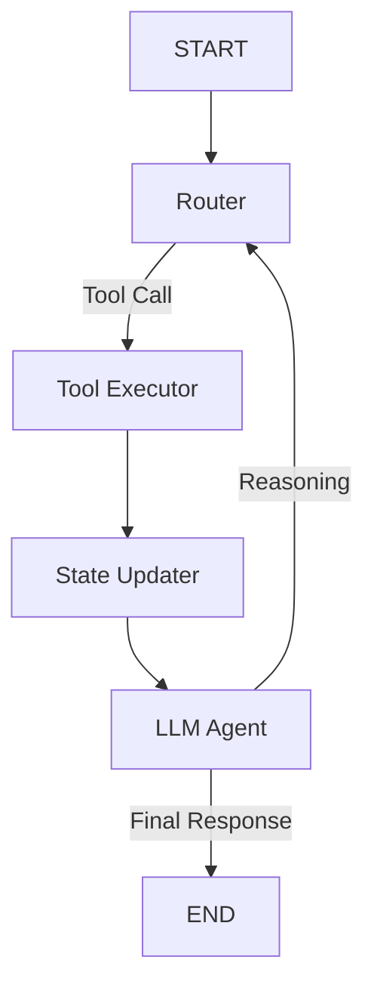

# System Architecture

OneProductIQ is an agentic e-commerce platform that implements intelligent product discovery, a persistent assistant widget, and multi-modal query search.

## Overview

The platform uses a hybrid local/remote architecture:
- **Local Services**: Qwen-VL:2B VLM for visual metadata extraction, ChromaDB for vector retrieval, and MongoDB for metadata storage.
- **Remote Services**: Groq or Google Gemini API for natural language reasoning and tool execution.

```
┌────────────────────────────────────────────────────────────────────────┐
│                      FRONTEND (Vite + React)                           │
│     - App Interface                                                    │
│     - Persistent Chatbot Widget (remembers conversation & cart)        │
└──────────────────────────────────┬─────────────────────────────────────┘
                                   │ HTTP (REST)
                                   ▼
┌────────────────────────────────────────────────────────────────────────┐
│                    FASTAPI BACKEND (Port 8000)                         │
│     - Routes /chat, /search, /upload, /products                        │
│     - Orchestrates LangGraph Agent & Tool Execution                    │
└──────┬───────────────────────────┬───────────────────────────────┬─────┘
       │                           │                               │
       ▼                           ▼                               ▼
┌──────────────┐            ┌──────────────┐               ┌──────────────┐
│  MongoDB     │            │  ChromaDB    │               │  Ollama VLM  │
│  Port 27017  │            │  Port 8288   │               │  Port 11434  │
│  Metadata    │            │  Vectors     │               │  Qwen3-VL    │
└──────────────┘            └──────────────┘               └──────────────┘
```

## Data Schema & Storage

We employ a **dual-database strategy** to keep operations fast and cost-free locally:

1. **MongoDB**: Serves as the primary source of truth for detailed product metadata (e.g. SKU, brand, price, colors, fabric composition, occasions).
2. **ChromaDB**: Stores the 384-dimensional vector embeddings of each product's metadata text generated by `sentence-transformers/all-MiniLM-L6-v2`.

### The Shared Key Principle

To prevent data sync issues, MongoDB and ChromaDB are linked 1-to-1 via a shared `product_id` key:
- When a product is ingested, it is first inserted into MongoDB.
- The resulting document `_id` is used as the document ID in ChromaDB.
- Searches in ChromaDB return matching IDs which are then resolved in MongoDB using a `$in` query.

## Multimodal Search Routing

To minimize LLM token costs and latency, search requests follow a rule-based input routing strategy:

- **Text-Only Prompt**: Text is embedded via `sentence-transformers` -> ChromaDB retrieves top-K product IDs -> MongoDB fetches metadata.
- **Image-Only Prompt**: Image is passed to local Qwen-VL -> VLM extracts descriptive metadata attributes -> Attributes are embedded -> ChromaDB similarity search retrieves visual matches.
- **Text + Image Prompt**: Visual analysis and text semantic parsing run in parallel. Results are merged and re-ranked using a combined scoring system.

## LangGraph Agent ReAct Loop

The `/chat` endpoint delegates user interaction to a compiled LangGraph application. The graph is built as a stateful ReAct loop:



### Agent Nodes:
- **LLM/Agent Node**: Uses the configured LLM (e.g. Gemini/Groq) to decide whether to search the store, recommend items, or answer.
- **Tool Executor**: Runs backend python tools (`search_store`, `get_recommendations`, `add_to_cart`).
- **State Updater**: Persists changes to the user's cart and recommendations list in the graph state.

### Checkpointing & Memory
Session history is persisted using LangGraph's in-memory `MemorySaver` checkpointer. Conversational context is partitioned using a `thread_id` (derived from the `user_id` passed from the frontend). Subsequent turns only load/append the new message, preserving the state of `cart` and `recommendations` across calls.
